# User Manual

----
## Concept
Users can buy & sell used textbooks

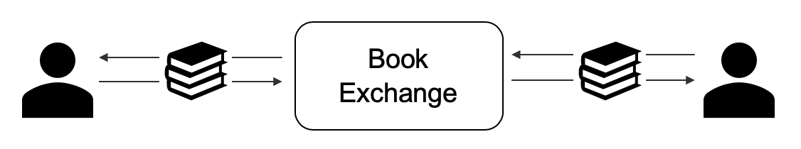

1. User A posts textbook for selling
1. User B buys textbook
1. User A ships textbook
1. User B receives textbook!

----
## Basic user story
I post textbook for selling and you buy it!

###1. User A posts textbook for selling
[User A] Go to [http://team1.work/signup](http://team1.work/signup), fill out the from, and click the "SINGUP" button

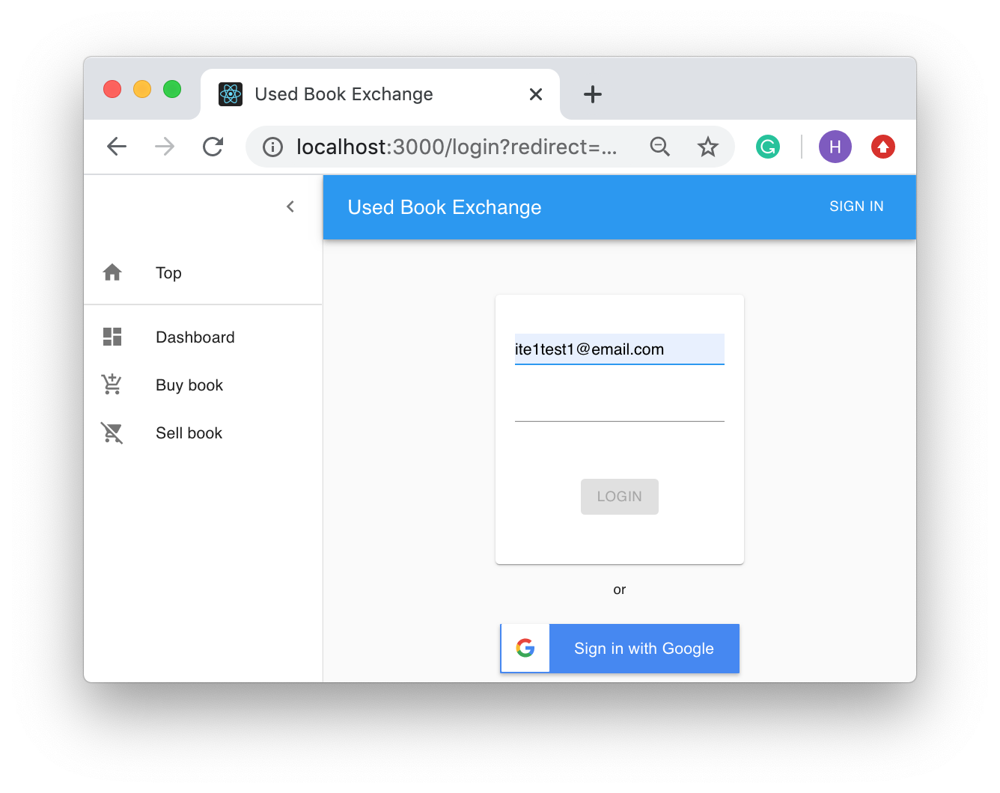{:height="30%" width="30%"}

[User A] Click the  "+" button

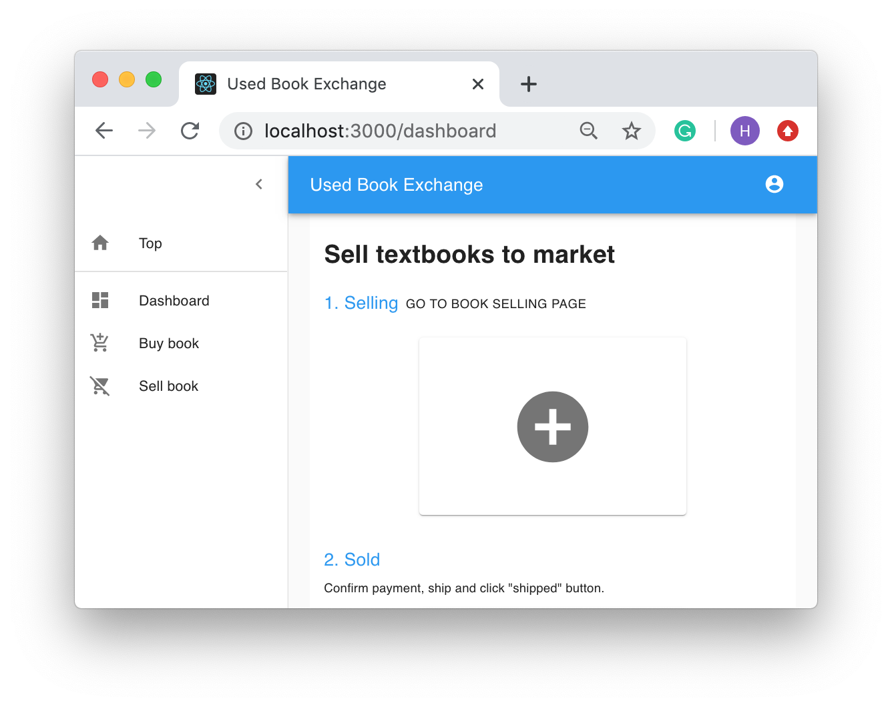{:height="30%" width="30%"}

[User A] Fill out the form, upload a file, and click the "create" button

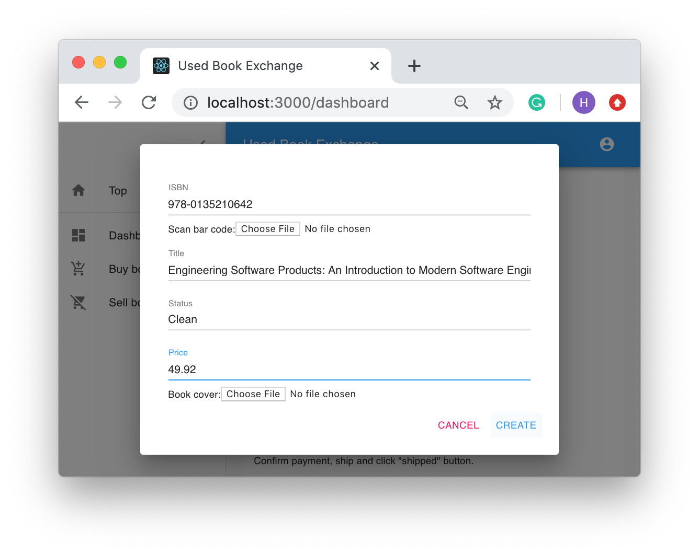{:height="30%" width="30%"}

{:height="30%" width="30%"}

###2. User B buys textbook
[User B] Log in by another user, click the "search" button

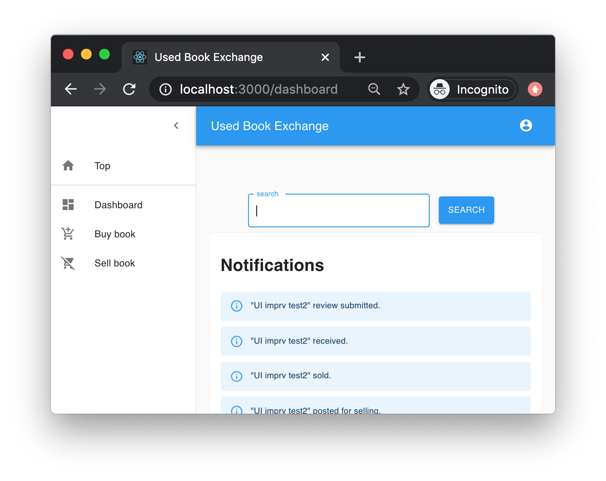{:height="30%" width="30%"}

[User B] Click the "buy" icon

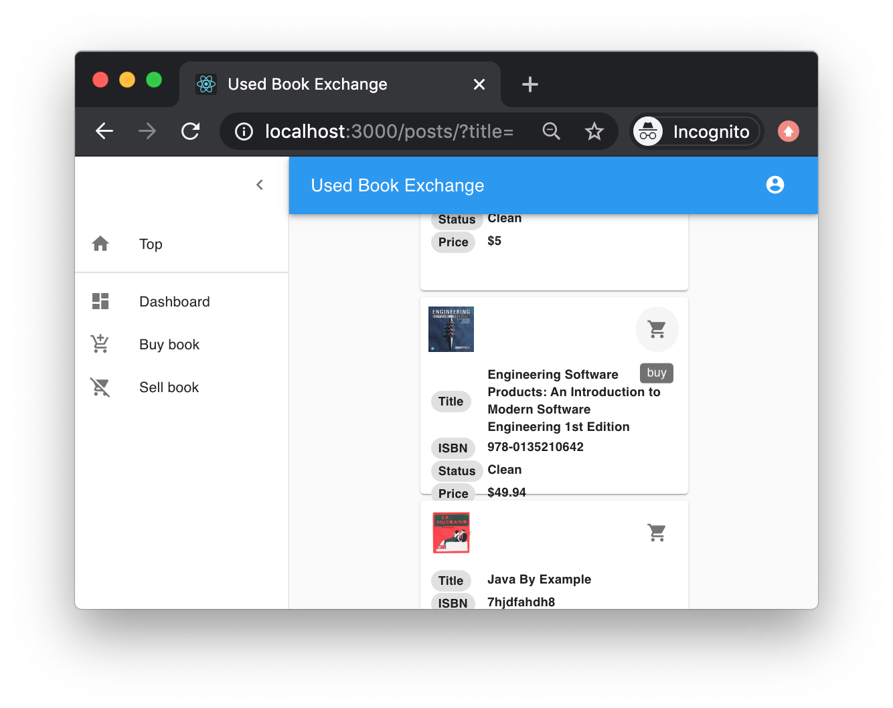{:height="30%" width="30%"}

[User B] Input the recipient and address box, and click the "BUY" button

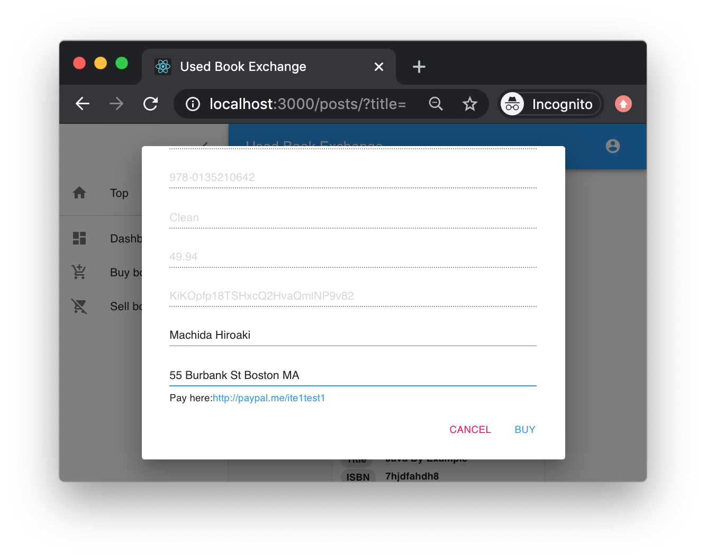{:height="30%" width="30%"}

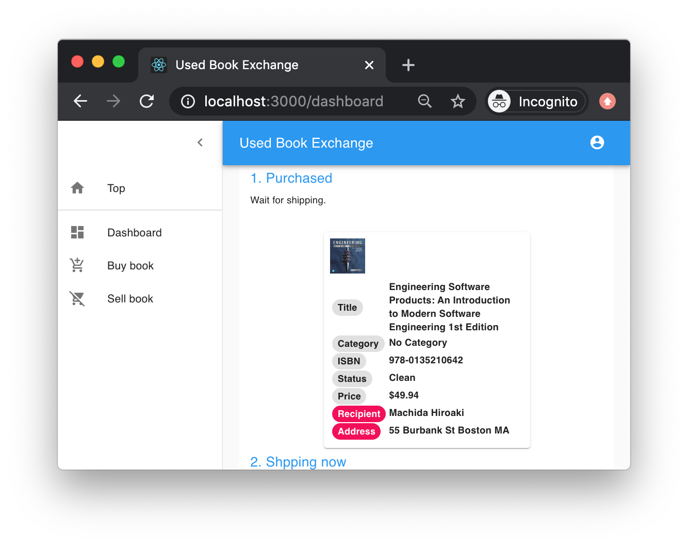{:height="30%" width="30%"}

[User B] Pay money at payal.me previously shown 

###3. User A ships textbook

[User A] Ship the textbook

[User A] Log in by the original user

[User A] Click the "shipped" button

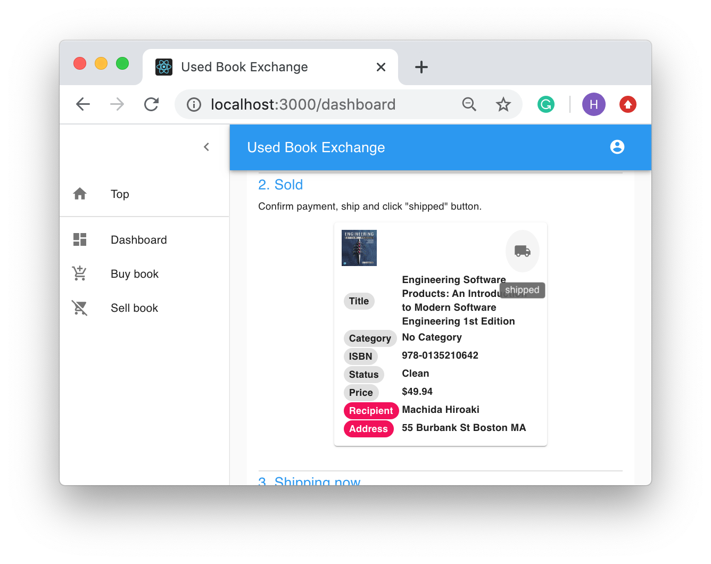{:height="30%" width="30%"}

{:height="30%" width="30%"}

###4. User B receives textbook!

[User B] Receive the textbook

[User B] Log in by the other user

[User B] Click the "received" button

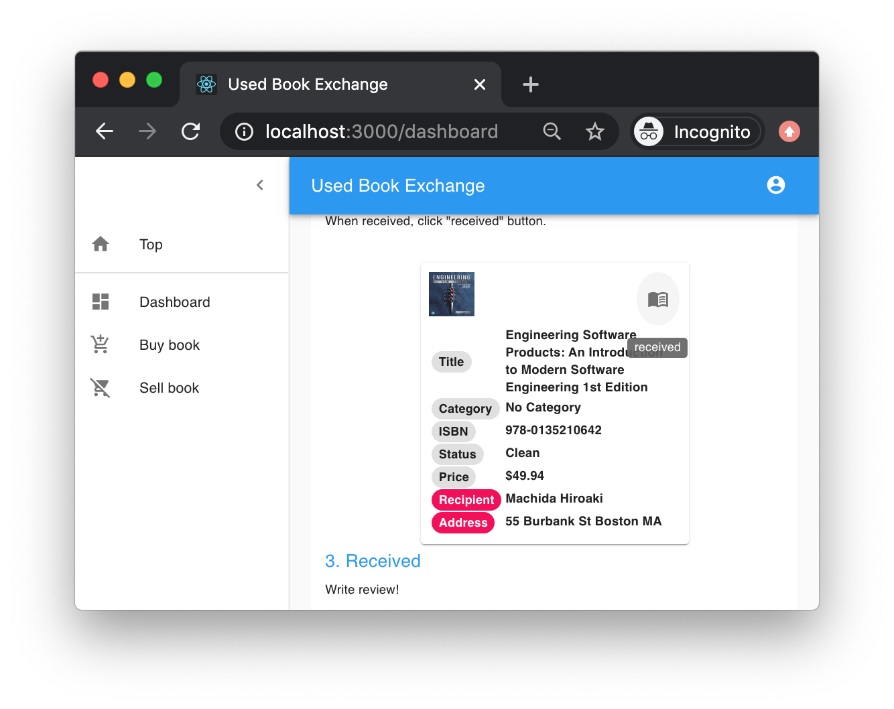{:height="30%" width="30%"}

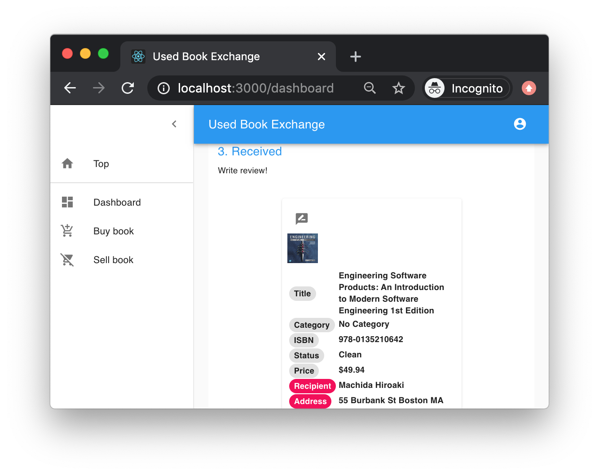{:height="30%" width="30%"}

[User A] Also can see the transaction

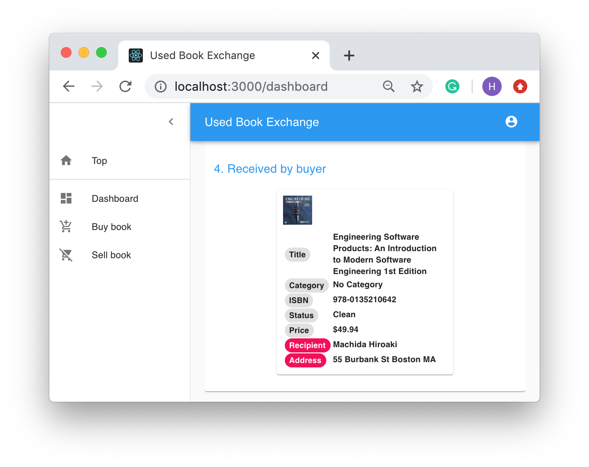{:height="30%" width="30%"}

